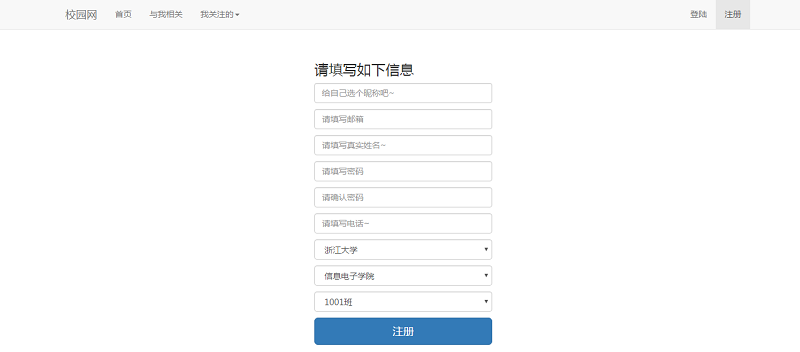
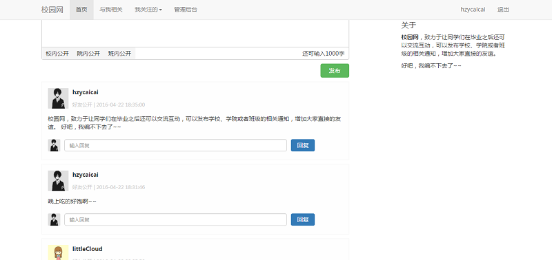
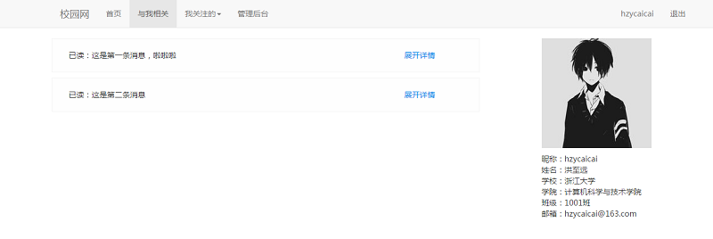

# schoolNet
website for students communicate after graduate
custom the CI framework, add filters and restful params
# filter
config in _filter function, set filter map, filter function will execute before request function
# simply restful params
convert the CI params to restful style, just support GET & POST, fill params to $_GET or $_POST
# just usage test
一个简单的小网站<slash>（简单测试CI框架好不好用）</dash>。
后端基于CI框架，并增加适度改造，比如增加filter（仿照yii），增加对restful形式url的支持。
前端view基于smarty3，js框架基于angular.js

#注册

#主页

#后台

#消息
